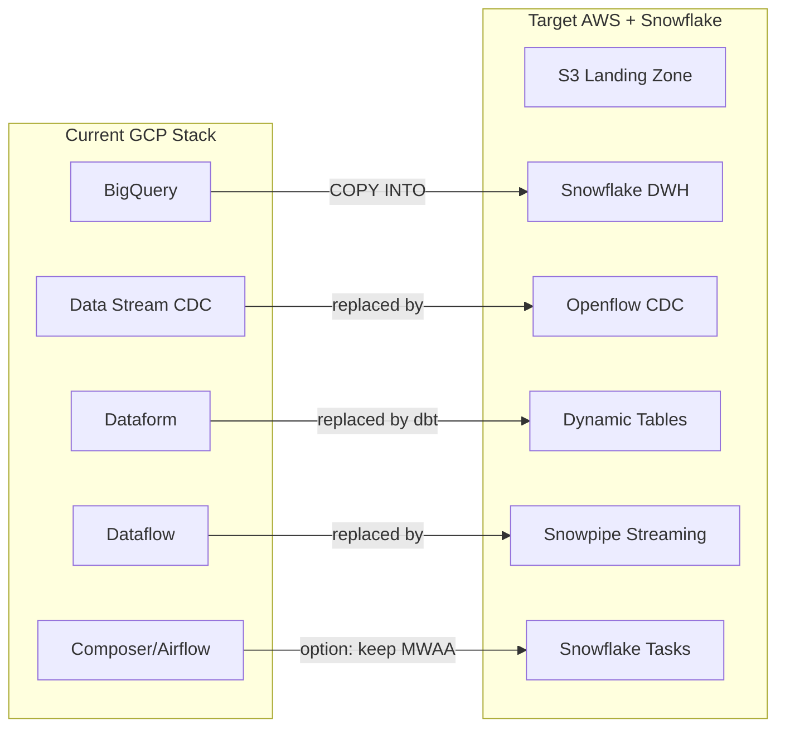

# Plan: Le Monde Demo Build

## Context

### What was explored

- Meeting transcript from June 16, 2026: first discovery call with Theo Simier (Head of Data Engineering & Data Science, Groupe Le Monde)
- Deep dive structure proposal: two 1h sessions already planned with demo slots (8 min + 7 min)
- Existing `NICE_MATIN_DEMO` database on this Snowflake account — another French press group demo with Piano events, GAM revenue, subscribers (with masking policies already applied). Strong structural template.
- Current Snowflake account databases and capabilities

### Key findings from discovery call

1. **Geopolitical driver** — Le Monde is evaluating alternatives to GCP because of strategic risk with Google (press/tech tensions). They're technically happy with BigQuery today.
2. **Theo is the gatekeeper** — if he's not convinced technically, it stops. He's rigorous, autonomous (95% Terraform coverage, no integrator).
3. **Three-way evaluation**: AWS native vs AWS + Databricks vs AWS + Snowflake.
4. **Top concerns**: Clear AWS/Snowflake boundaries, avoiding lock-in (Iceberg question), migration effort, Terraform leverage, pipeline migration (Dataflow, Data Stream CDC from Postgres).
5. **Demo must address**: schema evolution pain (BigQuery weakness), semi-structured native handling, governance (masking is Terraform-able), CDC replacement (Openflow vs Data Stream), transformation (Dynamic Tables vs scheduled queries).

### Existing patterns (from Nice Matin demo)

- `PIANO_EVENTS` — 500K rows, reader/paywall events
- `SUBSCRIBERS` — 57K rows with masking policies on FULL\_NAME, EMAIL, PHONE
- `GAM_REVENUE` — ad revenue data
- Governance schema with `MASK_PII` policy already defined

The Le Monde demo should follow this proven structure but be customized with:

- Le Monde-specific sections (Politique, International, Culture, Economie, Sport, Planete)
- Publications: Le Monde, Courrier International, Telerama, La Vie
- Larger scale hints (Le Monde is significantly bigger than Nice-Matin)
- VARIANT/schema evolution focus (their stated pain point)

---

## Architecture Overview



---

## Demo Structure — Mapped to Sessions

### Session 1 Demo (8 minutes) — "Differentiators"

| Minute | Demo                                                       | Theo's Concern Addressed                    |
| ------ | ---------------------------------------------------------- | ------------------------------------------- |
| 0-3    | Schema evolution: ingest JSON with new field, table adapts | Schema evolution pain with BigQuery         |
| 3-5    | VARIANT querying: nested JSON with dot notation + FLATTEN  | Semi-structured handling (vs JSON\_EXTRACT) |
| 5-8    | Column masking: same query, two roles, masked vs clear PII | Governance + Terraform-ability of RBAC      |

### Session 2 Demo (7 minutes) — "Migration Proof Points"

| Minute | Demo                                                              | Theo's Concern Addressed                     |
| ------ | ----------------------------------------------------------------- | -------------------------------------------- |
| 0-4    | Openflow CDC: PostgreSQL replicating into Snowflake table         | Data Stream replacement (pipeline migration) |
| 4-7    | Dynamic Table: declarative incremental transform with TARGET\_LAG | Dataform/scheduled query replacement         |

---

## Implementation Steps

### Task 1: Create LEMONDE\_DEMO database with synthetic press data

Create `LEMONDE_DEMO` database with schemas:

- `RAW` — landing zone (simulates S3 ingestion)
- `CURATED` — transformed/enriched data
- `GOVERNANCE` — masking policies and tags

Tables to create:

- `RAW.PIANO_EVENTS` — 500K+ reader/paywall events with sections matching Le Monde (Politique, International, Culture, Economie, Sport, Planete, Opinions, Sciences)
- `RAW.SUBSCRIBERS` — 80K subscribers across publications (Le Monde, Courrier International, Telerama, La Vie)
- `RAW.GAM_AD_REVENUE` — ad impressions/revenue by section and format
- `RAW.EDITORIAL_CMS` — article metadata (for CMS CDC demo scenario)
- `RAW.TRACKING_EVENTS_VARIANT` — VARIANT column with nested JSON (device, geo, consent, AB test metadata) for schema evolution + VARIANT demo

### Task 2: Schema evolution demo

```sql
-- Table with schema evolution enabled
CREATE TABLE RAW.TRACKING_INGEST (
    event_ts TIMESTAMP_NTZ,
    user_id VARCHAR,
    article_id VARCHAR,
    section VARCHAR
) ENABLE_SCHEMA_EVOLUTION = TRUE;

-- Batch 1: standard fields
COPY INTO RAW.TRACKING_INGEST FROM @stage/batch_1.json ...;

-- Batch 2: introduces "consent_status" and "ab_variant" fields
-- Table schema AUTOMATICALLY adds new columns
COPY INTO RAW.TRACKING_INGEST FROM @stage/batch_2.json ...;

-- Show the magic
DESCRIBE TABLE RAW.TRACKING_INGEST;
-- consent_status and ab_variant now appear!
```

Compare: in BigQuery this requires explicit `ALTER TABLE ADD COLUMN` or fails.

### Task 3: VARIANT semi-structured querying

```sql
-- Nested JSON in VARIANT column
SELECT
    raw:user_id::STRING AS user_id,
    raw:device.type::STRING AS device,
    raw:geo.country::STRING AS country,
    raw:consent.gdpr_accepted::BOOLEAN AS gdpr_consent
FROM RAW.TRACKING_EVENTS_VARIANT
WHERE raw:geo.country = 'FR';

-- FLATTEN for arrays
SELECT
    v.value:section::STRING AS section_visited,
    COUNT(*) AS visits
FROM RAW.TRACKING_EVENTS_VARIANT,
    LATERAL FLATTEN(input => raw:sections_visited) v
GROUP BY 1 ORDER BY 2 DESC;
```

Compare to BigQuery: `JSON_EXTRACT_SCALAR(raw, '$.device.type')` — verbose, no dot notation, no native FLATTEN.

### Task 4: Data governance (masking + RBAC)

```sql
-- Create masking policy (3 lines!)
CREATE MASKING POLICY GOVERNANCE.MASK_EMAIL AS (val STRING)
RETURNS STRING ->
  CASE WHEN CURRENT_ROLE() IN ('LEMONDE_ADMIN') THEN val
       ELSE REGEXP_REPLACE(val, '.+@', '****@') END;

-- Apply to column
ALTER TABLE RAW.SUBSCRIBERS MODIFY COLUMN EMAIL
  SET MASKING POLICY GOVERNANCE.MASK_EMAIL;

-- Demo: same query, different role → different results
USE ROLE LEMONDE_ANALYST;
SELECT email FROM RAW.SUBSCRIBERS LIMIT 5;  -- ****@lemonde.fr

USE ROLE LEMONDE_ADMIN;
SELECT email FROM RAW.SUBSCRIBERS LIMIT 5;  -- jean.dupont@lemonde.fr
```

Key message: this is fully declarative, Terraform-able (`snowflake_masking_policy` + `snowflake_masking_policy_grant` resources), and auditable.

### Task 5: Openflow CDC demo

Two approaches depending on time/access:

- **Option A (live)**: Set up a small PostgreSQL RDS instance, configure Openflow connector, show real-time replication of `editorial_articles` table changes flowing into Snowflake within seconds.
- **Option B (simulated)**: Pre-configure the Openflow connector, show the monitoring UI, insert rows into source → appear in Snowflake. Use Streams to show CDC metadata.

This directly replaces Google Data Stream. Key message: fully managed, no Dataflow/Beam code needed, latency < 5 seconds.

### Task 6: Dynamic Table transformation pipeline

```sql
CREATE DYNAMIC TABLE CURATED.READER_ENGAGEMENT
  TARGET_LAG = '5 minutes'
  WAREHOUSE = LEMONDE_TRANSFORM_WH
AS
SELECT
    user_id,
    DATE_TRUNC('day', event_ts) AS engagement_date,
    COUNT(DISTINCT article_id) AS articles_read,
    SUM(session_duration_sec) AS total_time_sec,
    COUNT_IF(section = 'Premium') AS premium_hits,
    MAX(event_ts) AS last_activity
FROM RAW.PIANO_EVENTS
GROUP BY 1, 2;
```

Key message: declarative, incremental (only processes new data), no scheduling code, no Airflow DAG. Replaces Dataform + BigQuery scheduled queries. `TARGET_LAG` gives you freshness SLAs without writing orchestration logic.

### Task 7: Demo script and talking points

Create a Snowsight SQL worksheet (or notebook) with:

- Clear section headers mapping to session agenda
- Inline `-- COMPARE TO BIGQUERY:` comments for Theo
- Timing markers
- Fallback queries if live demos fail
- Key messages highlighted per demo point

### Task 8: AWS + Snowflake architecture diagram

Create a reference architecture diagram showing:

- S3 as landing zone (raw files from various sources)
- Openflow for PostgreSQL CDC (replacing Data Stream)
- Snowpipe/Snowpipe Streaming for event ingestion
- Snowflake as the single analytics compute layer (no Athena, no Redshift needed)
- Terraform managing both AWS and Snowflake providers in the same CI/CD pipeline
- PrivateLink for secure connectivity
- Clear "AWS owns" vs "Snowflake owns" boundary lines

---

## Verification

After implementation:

1. Run each demo query end-to-end and confirm expected results
2. Verify masking policy returns masked data for ANALYST role and clear data for ADMIN role
3. Confirm Dynamic Table refreshes correctly (check `DYNAMIC_TABLE_REFRESH_HISTORY`)
4. Time each demo section — must fit within 8 min (session 1) and 7 min (session 2)
5. Test with Snowsight UI (Theo will likely see this in Snowsight, not a CLI)
6. Verify Terraform examples compile (show snippets of `snowflake_masking_policy`, `snowflake_dynamic_table` resources)

---

## Critical Files

- `NICE_MATIN_DEMO` database — structural template for press/media data models (already exists in Snowflake)
- LEMO\_Meeting\_Summary\_20260616.md — decision criteria and pain points to address
- LEMO\_Deep\_Dive\_Structure\_Proposal.md — session agenda and demo slot timing
- `/Users/edendulk/code/lemonde/` — working directory for demo scripts and assets (currently empty)

---

## Risk / Considerations

1. **Openflow CDC requires a PostgreSQL source** — either set up a small RDS instance or use the existing connector infrastructure. If not feasible in time, simulate with a pre-loaded Stream showing CDC metadata.
2. **Account is on GCP Frankfurt** (`EDDGCPFRANKFURT`) — for the real deployment Le Monde would be on AWS EU (Paris/Frankfurt). The demo works fine on GCP but mention this is a demo account; production would be AWS EU-WEST-3.
3. **Theo compares to Databricks** — be ready to contrast Dynamic Tables (declarative, SQL-native) vs Delta Live Tables (Spark-based, Python/SQL). Schema evolution is a strong Snowflake win vs both BQ and Databricks.
4. **Lock-in concern** — include an Iceberg table example showing data remains accessible via open formats if needed. Brief mention, not a full demo.
