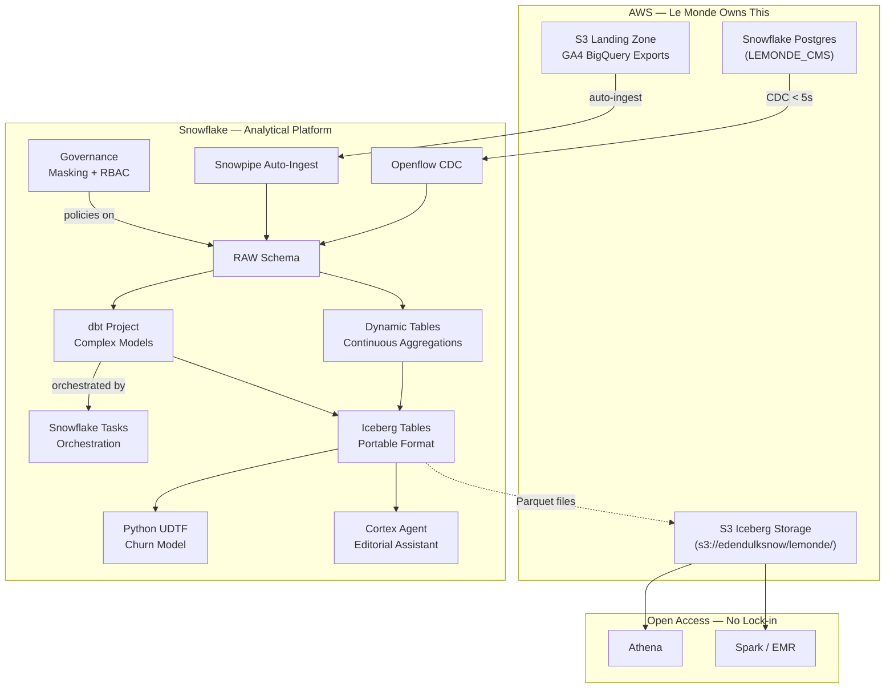

# Plan: Le Monde Demo — Final (LIZZY_USWEST)

## Context

### Account: SFSENORTHAMERICA-LIZZY_USWEST (AWS us-west-2)

This account already has everything we need:

| Capability | Status | Detail |
|-----------|--------|--------|
| Snowflake Postgres | READY | Instance `SS_POS_SOURCE` proves PG is enabled; we'll create `LEMONDE_CMS` |
| Iceberg on S3 | READY | `ICEBERG_EXTERNAL_VOLUME` → `s3://edendulksnow/` (us-west-2, ALLOW_WRITES=true) |
| Existing Iceberg tables | 5 tables | Pattern proven in `ICEBERG_LAB` database |
| Cortex AI | Available | LLMs confirmed working on GCP account; same org |
| Python ML packages | Available | scikit-learn 1.9, XGBoost 3.2, transformers 5.3 |
| dbt Projects | Enabled | `SHOW DBT PROJECTS` succeeds |
| Openflow | To confirm | Need to check/deploy runtime; Openflow CDC connector references available |
| Reference demos | Available | `CUSTOM_DEMOS.CULTURA_*` (dbt marts pattern), `SS_101` (agents, governance, semantic models) |

### What makes this demo win for Theo

The demo tells a **single connected story** — data flows from source to AI, each step answering one of Theo's stated concerns:

1. **"Who owns what?"** — Snowflake Postgres IS the CMS database. Openflow IS the CDC. Iceberg files live in YOUR S3. Clear boundaries.
2. **"Will I be locked in?"** — Iceberg data is open Parquet in S3. Query from Athena tomorrow.
3. **"How hard is migration?"** — Schema evolution is automatic. Openflow replaces Data Stream. dbt replaces Dataform 1:1. Tasks replace Composer/Airflow.
4. **"Can I Terraform this?"** — Every object shown has a Terraform resource. We mention it at every step.
5. **"What do I get that I don't have today?"** — Cortex Agent, Python UDTF churn model, no data movement for ML.

---

## Architecture



---

## Demo Flow

### Session 1 Demo (8 min) — "Why Snowflake is different from BigQuery"

| Min | Demo | Addresses |
|-----|------|-----------|
| 0-3 | **Schema evolution**: GA4 JSON batch 1 loads normally. Batch 2 has new fields (`consent_state`, `engagement_score`). Table adapts automatically — no DDL. | BigQuery schema pain |
| 3-5 | **VARIANT querying**: Nested GA4 events with dot notation + FLATTEN. Compare: `raw:device.browser` vs BigQuery's `JSON_EXTRACT_SCALAR(raw, '$.device.browser')`. | Semi-structured |
| 5-8 | **Column masking**: Same SELECT, two roles — LEMONDE_ANALYST sees `****@lemonde.fr`, LEMONDE_ADMIN sees `jean.dupont@lemonde.fr`. Show: "this is 3 lines of SQL and a Terraform resource." | Governance + Terraform |

### Session 2 Demo (12 min) — "Your architecture on AWS + Snowflake"

| Min | Demo | Addresses |
|-----|------|-----------|
| 0-2 | **Snowflake Postgres**: Show `LEMONDE_CMS` instance with editorial tables. "This is your Cloud SQL replacement — managed PG, same wire protocol, same tools." | Clear responsibility |
| 2-5 | **Openflow CDC**: INSERT an article in PG → query Snowflake 3s later → it's there. "This replaces Data Stream. Zero Beam code. Fully managed." | Pipeline migration |
| 5-7 | **Dynamic Table + dbt**: Show both coexisting — DT for simple continuous aggs, dbt for complex multi-join models. Task orchestrates dbt runs. "Your Dataform models migrate to dbt 1:1. Airflow patterns transfer to Tasks." | Transformation + orchestration |
| 7-9 | **Iceberg on S3**: Show the Iceberg table. Open S3 console — Parquet files are right there. "This is your data. Athena reads it. Spark reads it. You own it." | Lock-in / open formats |
| 9-11 | **Cortex Agent**: Ask in French: "Quels articles perdent des lecteurs cette semaine?" Agent queries the curated data and responds. "Your editorial team uses this directly." | AI differentiation |
| 11-12 | **BONUS Python UDTF**: `SELECT *, churn.* FROM subscribers, TABLE(predict_churn(...)) churn WHERE risk = 'HIGH'`. "scikit-learn model, callable in SQL. No SageMaker. Data doesn't move." | ML without infra |

---

## Implementation Steps

### Task 1: Create LEMONDE_DEMO database and schemas

```sql
CREATE DATABASE LEMONDE_DEMO COMMENT = 'Demo Le Monde — plateforme data presse';
CREATE SCHEMA LEMONDE_DEMO.RAW COMMENT = 'Landing zone (GA4, CMS CDC, subscribers)';
CREATE SCHEMA LEMONDE_DEMO.CURATED COMMENT = 'Dynamic Tables — aggregations continues';
CREATE SCHEMA LEMONDE_DEMO.MARTS COMMENT = 'dbt models — analytics complexes';
CREATE SCHEMA LEMONDE_DEMO.PORTABLE COMMENT = 'Iceberg tables — format ouvert sur S3';
CREATE SCHEMA LEMONDE_DEMO.GOVERNANCE COMMENT = 'Masking policies + RBAC';
CREATE SCHEMA LEMONDE_DEMO.ML COMMENT = 'Python UDTFs + model artifacts';
CREATE SCHEMA LEMONDE_DEMO.AI COMMENT = 'Cortex Agent + Semantic View';
```

### Task 2: Create Snowflake Postgres instance (LEMONDE_CMS)

Using `pg_connect.py --create` (Snowflake Postgres skill):
- Instance name: `LEMONDE_CMS`
- Compute: `BURST_M` (sufficient for demo)
- Storage: 10 GB
- Tables:
  - `articles` (article_id SERIAL, title TEXT, slug TEXT, author_id INT, section TEXT, publication TEXT, published_at TIMESTAMPTZ, word_count INT, paywall_type TEXT, tags JSONB, status TEXT)
  - `authors` (author_id SERIAL, name TEXT, section TEXT, seniority TEXT, bio TEXT)
  - `editorial_calendar` (entry_id SERIAL, article_id INT, planned_date DATE, editor_notes TEXT, priority TEXT, updated_at TIMESTAMPTZ)
- Populate with ~500 articles, 40 authors, 200 editorial entries
- Publications: Le Monde, Courrier International, Telerama, La Vie, Le Monde Diplomatique
- Sections: Politique, International, Economie, Culture, Sciences, Sport, Planete, Opinions, Societe

### Task 3: Deploy Openflow CDC connector (PG to Snowflake)

Following the Openflow skill connector deployment workflow:
- Source: `LEMONDE_CMS` PostgreSQL instance
- Destination: `LEMONDE_DEMO.RAW` schema
- Tables: `articles`, `authors`, `editorial_calendar`
- Mode: CDC (change data capture, logical replication)
- Target latency: < 5 seconds

Demo moment: INSERT a new article in PG, query `LEMONDE_DEMO.RAW.ARTICLES` 3 seconds later.

### Task 4: Generate synthetic GA4 data + schema evolution setup

Create GA4-style event data (matching BigQuery GA4 export format):
- 300K events across 30 days
- Event types: `page_view`, `scroll`, `click`, `session_start`, `paywall_hit`, `subscribe_click`, `share`
- Nested VARIANT structure:
  ```json
  {
    "event_name": "page_view",
    "event_timestamp": "2026-06-15T14:22:31Z",
    "user_pseudo_id": "abc123",
    "article_id": "ART_4521",
    "event_params": {"section": "Politique", "page_title": "..."},
    "device": {"category": "mobile", "browser": "Safari", "os": "iOS"},
    "geo": {"country": "FR", "city": "Paris", "region": "Ile-de-France"},
    "traffic_source": {"medium": "organic", "source": "google", "campaign": null}
  }
  ```

Schema evolution demo setup:
- Table: `LEMONDE_DEMO.RAW.GA4_TRACKING` with `ENABLE_SCHEMA_EVOLUTION = TRUE`
- Stage: `@LEMONDE_DEMO.RAW.GA4_STAGE` (internal or S3)
- Batch 1 files: standard schema
- Batch 2 files: adds `consent_state`, `engagement_score`, `ab_test_variant` fields
- COPY INTO loads both without error → DESCRIBE shows new columns appeared

Also create:
- `LEMONDE_DEMO.RAW.SUBSCRIBERS` — 80K subscribers with PII for masking demo
- `LEMONDE_DEMO.RAW.GA4_EVENTS_VARIANT` — full VARIANT column for dot-notation demo

### Task 5: Build governance layer (masking + RBAC)

```sql
-- Roles
CREATE ROLE LEMONDE_ADMIN;
CREATE ROLE LEMONDE_ANALYST;
CREATE ROLE LEMONDE_EDITORIAL;

-- Masking policies
CREATE MASKING POLICY LEMONDE_DEMO.GOVERNANCE.MASK_EMAIL AS (val STRING) RETURNS STRING ->
  CASE WHEN CURRENT_ROLE() IN ('LEMONDE_ADMIN','ACCOUNTADMIN') THEN val
       ELSE REGEXP_REPLACE(val, '.+@', '****@') END;

CREATE MASKING POLICY LEMONDE_DEMO.GOVERNANCE.MASK_NAME AS (val STRING) RETURNS STRING ->
  CASE WHEN CURRENT_ROLE() IN ('LEMONDE_ADMIN','ACCOUNTADMIN') THEN val
       ELSE '*** MASKED ***' END;

CREATE MASKING POLICY LEMONDE_DEMO.GOVERNANCE.MASK_PHONE AS (val STRING) RETURNS STRING ->
  CASE WHEN CURRENT_ROLE() IN ('LEMONDE_ADMIN','ACCOUNTADMIN') THEN val
       ELSE CONCAT('+33 **** ** ', RIGHT(val, 2)) END;

-- Apply to subscriber table
ALTER TABLE LEMONDE_DEMO.RAW.SUBSCRIBERS MODIFY COLUMN EMAIL SET MASKING POLICY ...;
ALTER TABLE LEMONDE_DEMO.RAW.SUBSCRIBERS MODIFY COLUMN FULL_NAME SET MASKING POLICY ...;
ALTER TABLE LEMONDE_DEMO.RAW.SUBSCRIBERS MODIFY COLUMN PHONE SET MASKING POLICY ...;

-- Grants so the demo works with USE ROLE switches
GRANT USAGE ON DATABASE LEMONDE_DEMO TO ROLE LEMONDE_ANALYST;
-- ... full grant chain
```

Talking point at each step: "Terraform resource: `snowflake_masking_policy`, `snowflake_role_grants`."

### Task 6: Build Dynamic Tables (continuous aggregations)

```sql
-- Reader engagement by section (replaces a BigQuery scheduled query)
CREATE DYNAMIC TABLE LEMONDE_DEMO.CURATED.READER_ENGAGEMENT
  TARGET_LAG = '5 minutes'
  WAREHOUSE = SS_DEV_WH
AS
SELECT
    DATE_TRUNC('day', event_timestamp) AS day,
    section,
    publication,
    COUNT(DISTINCT user_pseudo_id) AS unique_readers,
    COUNT(*) AS page_views,
    AVG(engagement_time_sec) AS avg_engagement_sec,
    COUNT_IF(event_name = 'paywall_hit') AS paywall_hits,
    COUNT_IF(event_name = 'subscribe_click') AS subscribe_clicks,
    ROUND(COUNT_IF(event_name = 'subscribe_click') / NULLIF(COUNT_IF(event_name = 'paywall_hit'), 0) * 100, 1) AS conversion_rate_pct
FROM LEMONDE_DEMO.RAW.GA4_EVENTS
GROUP BY 1, 2, 3;

-- Article performance (joins CDC data with GA4 events)
CREATE DYNAMIC TABLE LEMONDE_DEMO.CURATED.ARTICLE_PERFORMANCE
  TARGET_LAG = '10 minutes'
  WAREHOUSE = SS_DEV_WH
AS
SELECT
    a.article_id, a.title, a.author, a.section, a.publication, a.published_at,
    COUNT(DISTINCT e.user_pseudo_id) AS unique_readers,
    AVG(e.engagement_time_sec) AS avg_read_time_sec,
    COUNT_IF(e.scroll_pct >= 75) AS deep_reads,
    COUNT_IF(e.event_name = 'share') AS shares,
    DATEDIFF('hour', a.published_at, MAX(e.event_timestamp)) AS lifespan_hours
FROM LEMONDE_DEMO.RAW.ARTICLES a
LEFT JOIN LEMONDE_DEMO.RAW.GA4_EVENTS e ON e.article_id = a.article_id
GROUP BY 1, 2, 3, 4, 5, 6;
```

### Task 7: Build dbt Project + Task orchestration

dbt project structure:
```
lemonde_dbt/
  dbt_project.yml
  models/
    staging/
      stg_ga4_sessions.sql       -- sessionize raw events
      stg_subscribers.sql        -- clean/enrich subscriber data
    marts/
      content_analytics.sql      -- complex content perf (window fns, multi-join)
      subscriber_journey.sql     -- user journey from first visit to subscription
      churn_features.sql         -- feature engineering for ML model
```

Deploy and orchestrate:
```sql
-- Deploy dbt project to Snowflake
-- (done via snow dbt deploy from CLI)

-- Orchestrate with Task
CREATE TASK LEMONDE_DEMO.MARTS.RUN_DBT_CONTENT
  WAREHOUSE = SS_DEV_WH
  SCHEDULE = 'USING CRON 0 */4 * * * Europe/Paris'
AS
  EXECUTE DBT PROJECT LEMONDE_DEMO.MARTS.LEMONDE_DBT
    MODELS = '+marts/content_analytics +marts/subscriber_journey';
```

Key message: "Dynamic Tables for simple, continuous aggregations. dbt for complex business logic with tests and docs. Tasks orchestrate both — your Airflow patterns map directly."

### Task 8: Create Iceberg tables on S3

Using existing `ICEBERG_EXTERNAL_VOLUME` (→ `s3://edendulksnow/`):

```sql
-- Iceberg table — data stored as Parquet in S3
CREATE ICEBERG TABLE LEMONDE_DEMO.PORTABLE.ARTICLE_METRICS
  CATALOG = 'SNOWFLAKE'
  EXTERNAL_VOLUME = 'ICEBERG_EXTERNAL_VOLUME'
  BASE_LOCATION = 'lemonde/article_metrics/'
AS
SELECT * FROM LEMONDE_DEMO.CURATED.ARTICLE_PERFORMANCE;

CREATE ICEBERG TABLE LEMONDE_DEMO.PORTABLE.READER_TRENDS
  CATALOG = 'SNOWFLAKE'
  EXTERNAL_VOLUME = 'ICEBERG_EXTERNAL_VOLUME'
  BASE_LOCATION = 'lemonde/reader_trends/'
AS
SELECT * FROM LEMONDE_DEMO.CURATED.READER_ENGAGEMENT;
```

Demo moment:
1. Query the Iceberg table in Snowflake — works identically to any table
2. Show S3 console: `s3://edendulksnow/lemonde/article_metrics/data/*.parquet`
3. "These Parquet files are queryable from Athena, Spark, Trino — right now. No export."

Talking point: "Native tables by default (best performance + governance). Iceberg when portability is an explicit requirement. Both coexist in the same database."

### Task 9: Build Cortex Agent (French editorial assistant)

1. Create a semantic view on the curated/mart tables:
```sql
-- Semantic view describing the content analytics model
CREATE SEMANTIC VIEW LEMONDE_DEMO.AI.CONTENT_SV ...
```

2. Create the agent:
```sql
CREATE CORTEX AGENT LEMONDE_DEMO.AI.EDITORIAL_ASSISTANT
  TOOLS = (
    snowflake_data_tool(
      semantic_view => 'LEMONDE_DEMO.AI.CONTENT_SV'
    )
  )
  COMMENT = 'Assistant editorial Le Monde — performances articles, tendances lecteurs';
```

3. Test queries:
- "Quels articles ont le meilleur engagement cette semaine?"
- "Quelle section perd des lecteurs par rapport au mois dernier?"
- "Montre-moi les articles premium avec un fort taux de rebond"
- "Compare International vs Politique en nombre de lecteurs uniques"

### Task 10: Build Python UDTF churn model

1. Train a simple GradientBoosting classifier on subscriber features:
   - Input: days_since_last_login, articles_read_30d, subscription_months, avg_session_sec, paywall_bounces_30d
   - Output: churn_probability, risk_segment (HIGH/MEDIUM/LOW)

2. Serialize model to stage:
```sql
CREATE STAGE LEMONDE_DEMO.ML.MODELS;
-- PUT file://churn_model.pkl @LEMONDE_DEMO.ML.MODELS;
```

3. Create UDTF:
```sql
CREATE FUNCTION LEMONDE_DEMO.ML.PREDICT_CHURN(...)
RETURNS TABLE (churn_probability FLOAT, risk_segment VARCHAR)
LANGUAGE PYTHON
RUNTIME_VERSION = '3.11'
PACKAGES = ('scikit-learn', 'pandas', 'numpy', 'joblib', 'cachetools')
IMPORTS = ('@LEMONDE_DEMO.ML.MODELS/churn_model.pkl')
HANDLER = 'ChurnPredictor'
AS $$ ... $$;
```

4. Demo usage:
```sql
SELECT s.user_id, s.subscription_type, s.ltv_eur,
       c.churn_probability, c.risk_segment
FROM LEMONDE_DEMO.RAW.SUBSCRIBERS s,
     TABLE(LEMONDE_DEMO.ML.PREDICT_CHURN(
         DATEDIFF('day', s.last_login, CURRENT_DATE()),
         s.articles_read_30d,
         DATEDIFF('month', s.start_date, CURRENT_DATE()),
         s.avg_session_sec,
         s.paywall_bounces_30d
     )) c
WHERE c.risk_segment = 'HIGH'
ORDER BY s.ltv_eur DESC;
```

### Task 11: Create demo run-through script

A single Snowsight SQL worksheet (or Snowflake Notebook):
- Numbered sections matching session flow
- `-- [COMPARE TO BIGQUERY]` annotations
- `-- [TERRAFORM RESOURCE]` annotations at each CREATE
- Timing markers: `-- === SECTION 2 (minute 3-5) ===`
- Reset script: `DROP DATABASE LEMONDE_DEMO; -- then re-run setup`
- Fallback queries for each section (pre-loaded data paths)
- Terraform snippet appendix (show actual `.tf` code for key objects)

---

## Verification Checklist

| Check | How |
|-------|-----|
| Schema evolution works | COPY INTO with new fields succeeds; DESCRIBE shows added columns |
| VARIANT dot notation | Queries return correct nested values |
| Masking works | `USE ROLE LEMONDE_ANALYST` → masked; `USE ROLE LEMONDE_ADMIN` → clear |
| PG INSERT → Snowflake | Openflow latency < 5s measured end-to-end |
| Dynamic Table refreshes | `DYNAMIC_TABLE_REFRESH_HISTORY` shows incremental |
| dbt Project runs | `EXECUTE DBT PROJECT` completes successfully |
| Iceberg files in S3 | AWS console shows Parquet files at base_location |
| Cortex Agent answers French | 4+ test queries return relevant results |
| Python UDTF returns predictions | Output has valid probabilities (0-1) and segments |
| Timing | Each session demo segment fits allocated minutes (dry run) |

---

## Critical Files and Assets

| Asset | Purpose |
|-------|---------|
| [LEMO_Meeting_Summary_20260616.md](/Users/edendulk/Documents/transcripts/LEMO_Meeting_Summary_20260616.md) | Decision criteria and pain points |
| [LEMO_Deep_Dive_Structure_Proposal.md](/Users/edendulk/Documents/transcripts/LEMO_Deep_Dive_Structure_Proposal.md) | Session agenda and timing |
| `ICEBERG_EXTERNAL_VOLUME` (Snowflake) | Pre-configured S3 external volume for Iceberg |
| `SS_POS_SOURCE` (Snowflake Postgres) | Reference for instance creation pattern |
| `CUSTOM_DEMOS.CULTURA_*` (Snowflake) | dbt marts structure reference |
| `/Users/edendulk/code/lemonde/` | Working directory for scripts, dbt project, model |
