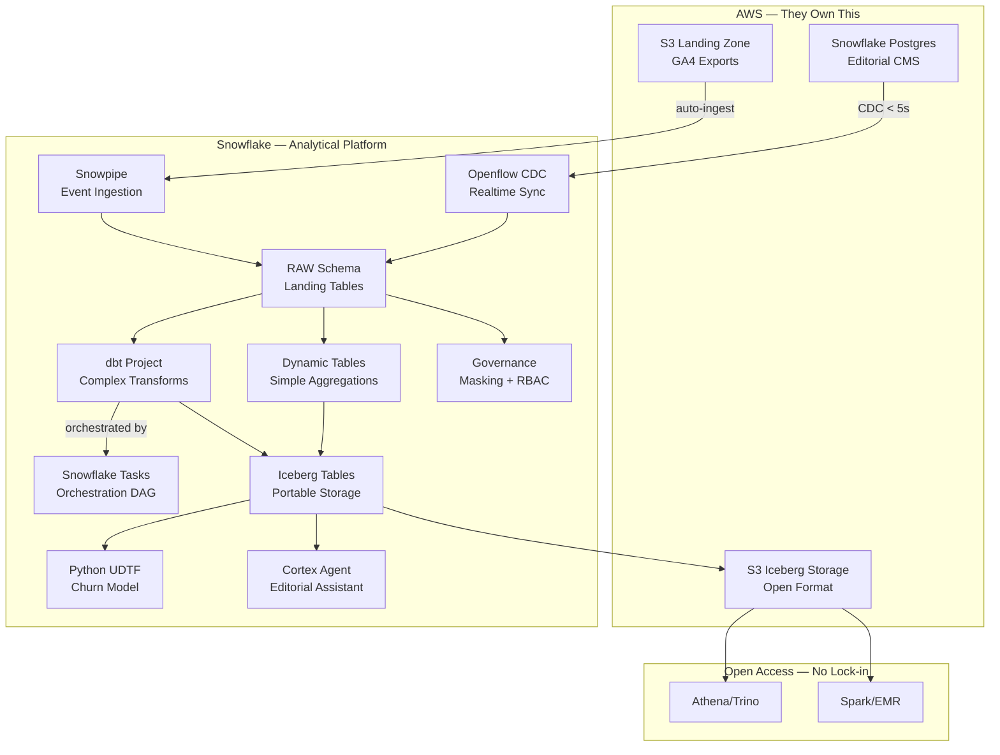

# Plan: Le Monde Demo — "Pimped" Version

## Context

### Why this demo wins

Theo's top concern is **"I don't want unclear responsibility between AWS and Snowflake."** This demo answers that with a **connected story** where every component has a clear owner:

- **AWS owns:** S3 (landing zone + Iceberg storage), RDS/Snowflake Postgres (CMS source), network (PrivateLink)
- **Snowflake owns:** compute, transformation, governance, ML inference, AI agent
- **Iceberg bridges both:** data in S3 (Parquet/Iceberg), queryable from Snowflake AND accessible via Spark/Athena/Trino — no lock-in

### What we found on the account

- Cortex AI LLMs work (tested COMPLETE with mistral-large2)
- Python packages available: scikit-learn 1.9.0, XGBoost 3.2.0, transformers 5.3.0, sentence-transformers 5.3.0
- `SHOW DBT PROJECTS` works (dbt Projects on Snowflake is enabled)
- Existing Iceberg infrastructure: `UNLMT_ICEBERG_VOL` external volume on GCS — need a new **AWS S3** volume for this demo
- Snowflake Postgres: not available on this GCP account — **must use an AWS-region SE demo account** or request enablement. This is actually fine since the whole Le Monde story targets AWS.

### Account strategy

This demo should be **built on an AWS EU (Frankfurt or Paris) demo account** since:
1. Snowflake Postgres requires AWS
2. Iceberg on S3 needs an AWS external volume
3. Le Monde's target architecture IS AWS
4. Shows them what their actual deployment would look like (same region, same cloud)

The GCP Frankfurt account can be used for dev/testing of SQL scripts, but the final demo should run on AWS.

---

## Demo Architecture



---

## Demo Flow — Telling the Story (2 sessions)

### Session 1: Platform Fundamentals (8 min demo slot)

| # | Demo | What it proves | Theo's concern |
|---|------|----------------|----------------|
| 1 | Schema evolution: GA4 JSON ingestion, new field arrives mid-batch, table adapts | BigQuery's biggest pain point solved natively | Schema evolution |
| 2 | VARIANT: nested GA4 events with dot notation + FLATTEN | No more JSON_EXTRACT gymnastics | Semi-structured handling |
| 3 | Column masking: subscriber PII masked by role (3 lines SQL) | Governance is SQL-native, Terraform-able | RBAC + compliance |

### Session 2: Architecture + Migration Proof (7 min demo slot — extended to ~12 min with bonus)

| # | Demo | What it proves | Theo's concern |
|---|------|----------------|----------------|
| 4 | Snowflake Postgres: editorial CMS running on managed PG | Their Cloud SQL replaces 1:1 on Snowflake's side | Clear responsibility |
| 5 | Openflow CDC: INSERT article in PG, appears in Snowflake in seconds | Data Stream replacement — zero code, fully managed | Pipeline migration |
| 6 | Dynamic Table: incremental reader engagement summary | Replaces scheduled queries, declarative, auto-refresh | Transformation |
| 7 | dbt Project on Snowflake + Task orchestration: complex content analytics model | Shows dbt coexists with Dynamic Tables, Tasks orchestrate both | Orchestration |
| 8 | Iceberg table on S3: same data, accessible from Athena | Open format — data is portable, no lock-in | Lock-in concern |
| 9 | Cortex Agent: editorial staff asks "Quels articles perdent des lecteurs cette semaine?" in French | Non-technical users get value from the pipeline | AI/differentiation |
| 10 | **BONUS** Python UDTF: churn prediction model in SQL | ML without SageMaker, data never leaves Snowflake | ML/data science |

---

## Implementation Steps

### Task 1: Provision AWS infrastructure

- Create an S3 bucket for Iceberg storage (`s3://lemonde-demo-iceberg-eu/`)
- Create an S3 bucket for GA4 landing zone (`s3://lemonde-demo-landing-eu/`)
- Set up IAM role for Snowflake external volume access (trust policy)
- Create external volume pointing to the Iceberg S3 location
- Create storage integration for Snowpipe auto-ingest from landing zone

This is the AWS foundation. Done once, Terraform-able (show the TF snippet during demo).

### Task 2: Create Snowflake Postgres instance (editorial CMS)

Using `pg_connect.py --create`:
- Instance: `LEMONDE_CMS`
- Compute: appropriate family for demo
- Tables to create inside PG:
  - `articles` (article_id, title, author, section, publication, published_at, word_count, paywall_type, tags JSONB)
  - `authors` (author_id, name, section, seniority)
  - `editorial_notes` (note_id, article_id, editor_comment, status, updated_at)

This simulates their Cloud SQL editorial CMS. During the demo, we INSERT a new article and watch it flow through.

### Task 3: Deploy Openflow CDC connector (PG to Snowflake)

Using the Openflow skill:
- Deploy a PostgreSQL CDC connector from `LEMONDE_CMS` to Snowflake
- Target: `LEMONDE_DEMO.RAW` schema
- Tables: `articles`, `authors`, `editorial_notes`
- Latency target: < 5 seconds

During demo: INSERT an article row in PG, query Snowflake 3 seconds later — it's there.

### Task 4: Generate synthetic Google Analytics data + schema evolution demo

Create sample GA4 export data as JSON files in S3:
- Standard events: page_view, scroll, click, session_start
- Nested structure: `event_params` (array of key-value pairs), `device` (category, browser, OS), `geo` (country, city, region), `traffic_source` (medium, source, campaign)
- Two batches:
  - Batch 1: standard GA4 schema
  - Batch 2: adds `consent_state`, `engagement_score`, `subscription_prompt_shown` (new fields that appear mid-stream)

Table with `ENABLE_SCHEMA_EVOLUTION = TRUE` — batch 2 loads without DDL changes.

Also load subscriber data (80K rows) with columns for masking demo: full_name, email, phone, subscription_type, start_date, ltv_eur, churn_flag.

### Task 5: Build governance layer (masking + RBAC)

```sql
-- Roles mirroring their Terraform structure
CREATE ROLE LEMONDE_ADMIN;    -- full access
CREATE ROLE LEMONDE_ANALYST;  -- masked PII
CREATE ROLE LEMONDE_EDITORIAL; -- article data only

-- Masking policy (show: it's 3 lines)
CREATE MASKING POLICY mask_email AS (val STRING) RETURNS STRING ->
  CASE WHEN CURRENT_ROLE() IN ('LEMONDE_ADMIN') THEN val
       ELSE REGEXP_REPLACE(val, '.+@', '****@') END;

-- Apply + demo with role switch
```

Key talking point: "This is a Terraform resource: `snowflake_masking_policy` + `snowflake_masking_policy_grant`."

### Task 6: Build Dynamic Tables (simple aggregations)

```sql
CREATE DYNAMIC TABLE LEMONDE_DEMO.CURATED.READER_ENGAGEMENT
  TARGET_LAG = '5 minutes'
  WAREHOUSE = LEMONDE_TRANSFORM_WH
AS
SELECT
    DATE_TRUNC('day', event_timestamp) AS day,
    section,
    publication,
    COUNT(DISTINCT user_pseudo_id) AS unique_readers,
    COUNT(*) AS page_views,
    AVG(engagement_time_sec) AS avg_engagement_sec,
    COUNT_IF(event_name = 'paywall_hit') AS paywall_hits,
    COUNT_IF(event_name = 'subscribe_click') AS subscribe_clicks
FROM LEMONDE_DEMO.RAW.GA4_EVENTS
GROUP BY 1, 2, 3;

CREATE DYNAMIC TABLE LEMONDE_DEMO.CURATED.ARTICLE_PERFORMANCE
  TARGET_LAG = '10 minutes'
  WAREHOUSE = LEMONDE_TRANSFORM_WH
AS
SELECT
    a.article_id,
    a.title,
    a.author,
    a.section,
    a.published_at,
    COUNT(DISTINCT e.user_pseudo_id) AS unique_readers,
    AVG(e.engagement_time_sec) AS avg_read_time,
    SUM(CASE WHEN e.event_name = 'scroll' AND e.percent_scrolled >= 75 THEN 1 ELSE 0 END) AS deep_reads
FROM LEMONDE_DEMO.RAW.ARTICLES a
JOIN LEMONDE_DEMO.RAW.GA4_EVENTS e ON e.article_id = a.article_id
GROUP BY 1, 2, 3, 4, 5;
```

Message: "No scheduler. No Airflow DAG. The table declares what it wants to look like. Snowflake handles when and how to refresh incrementally."

### Task 7: Build dbt Project on Snowflake + Task orchestration

Create a dbt project with 2-3 models showing the **complement** to Dynamic Tables:

```
models/
  staging/
    stg_ga4_events.sql        -- clean GA4 events (dedup, type cast)
    stg_subscribers.sql        -- subscriber enrichment
  marts/
    content_analytics.sql      -- complex multi-join content performance
    subscriber_journey.sql     -- sessionized user journeys (window functions)
```

Deploy using `snow dbt deploy`, then orchestrate with a Snowflake Task:

```sql
CREATE TASK LEMONDE_DEMO.ORCHESTRATION.RUN_DBT_CONTENT_ANALYTICS
  WAREHOUSE = LEMONDE_TRANSFORM_WH
  SCHEDULE = 'USING CRON 0 */2 * * * Europe/Paris'
AS
  EXECUTE DBT PROJECT LEMONDE_DEMO.ANALYTICS.CONTENT_DBT
    MODELS = 'marts/content_analytics';
```

Talking point: "Dynamic Tables for simple aggregations that need continuous freshness. dbt for complex business logic with tests and documentation. Tasks to orchestrate everything — including dbt runs. Your Airflow patterns translate directly."

### Task 8: Create Iceberg tables on AWS S3

```sql
CREATE ICEBERG TABLE LEMONDE_DEMO.PORTABLE.ARTICLE_METRICS
  CATALOG = 'SNOWFLAKE'
  EXTERNAL_VOLUME = 'LEMONDE_S3_VOLUME'
  BASE_LOCATION = 'article_metrics/'
AS
SELECT * FROM LEMONDE_DEMO.CURATED.ARTICLE_PERFORMANCE;

-- Show the data is just Parquet on S3
-- Then show: Athena can query the same files
-- Then show: the table works identically in Snowflake SQL
SELECT * FROM LEMONDE_DEMO.PORTABLE.ARTICLE_METRICS
WHERE section = 'Politique' AND unique_readers > 10000;
```

Talking point: "Your data sits in S3 as Parquet/Iceberg. If you ever want to query it from Spark, Athena, or Trino — you can. No export needed. This is your exit strategy, baked in from day one."

Demo moment: open AWS console, show the Parquet files sitting in S3. "This is your data. It's not locked inside Snowflake."

### Task 9: Build Cortex Agent (editorial assistant)

Create an agent that editorial staff can query in French:

```sql
CREATE CORTEX AGENT LEMONDE_DEMO.AI.EDITORIAL_ASSISTANT
  TOOLS = (
    snowflake_data_tool(
      semantic_view => 'LEMONDE_DEMO.AI.CONTENT_SEMANTIC_VIEW'
    )
  )
  COMMENT = 'Assistant editorial pour Le Monde — repond aux questions sur les performances des articles'
;
```

Requires a semantic view on the curated tables. Questions the agent answers:
- "Quels articles ont le plus de lecteurs cette semaine?"
- "Quelle section perd des abonnes?"
- "Montre-moi les articles avec un fort engagement mais peu de conversions"
- "Compare les performances du Monde vs Courrier International ce mois-ci"

Talking point: "Your editorial team asks questions in French. No SQL. No dashboard. They get answers from the same pipeline we just built."

### Task 10: Python UDTF — Churn prediction model (bonus)

```sql
CREATE OR REPLACE FUNCTION LEMONDE_DEMO.ML.PREDICT_CHURN(
    days_since_last_login INT,
    articles_read_30d INT,
    subscription_months INT,
    avg_session_sec FLOAT,
    paywall_bounces_30d INT
)
RETURNS TABLE (churn_probability FLOAT, risk_segment VARCHAR)
LANGUAGE PYTHON
RUNTIME_VERSION = '3.11'
PACKAGES = ('scikit-learn', 'pandas', 'numpy', 'cachetools')
HANDLER = 'ChurnPredictor'
AS $$
import pandas as pd
import numpy as np
from sklearn.ensemble import GradientBoostedClassifier
from cachetools import cached, TTLCache

# Pre-trained model weights loaded from stage
class ChurnPredictor:
    def __init__(self):
        self.model = self._load_model()
    
    @cached(cache=TTLCache(maxsize=1, ttl=3600))
    def _load_model(self):
        # Load pre-trained model from internal stage
        import joblib
        import sys
        return joblib.load(sys.path[0] + '/churn_model.pkl')
    
    def process(self, days_since_last_login, articles_read_30d, 
                subscription_months, avg_session_sec, paywall_bounces_30d):
        features = pd.DataFrame({
            'days_inactive': [days_since_last_login],
            'articles_30d': [articles_read_30d],
            'tenure_months': [subscription_months],
            'avg_session': [avg_session_sec],
            'bounces_30d': [paywall_bounces_30d]
        })
        prob = self.model.predict_proba(features)[0][1]
        segment = 'HIGH' if prob > 0.7 else 'MEDIUM' if prob > 0.4 else 'LOW'
        yield (prob, segment)
$$;

-- Usage: call it in SQL like any function
SELECT s.user_id, s.email, s.subscription_type,
       churn.*
FROM LEMONDE_DEMO.RAW.SUBSCRIBERS s,
     TABLE(LEMONDE_DEMO.ML.PREDICT_CHURN(
         DATEDIFF('day', s.last_login, CURRENT_DATE()),
         s.articles_read_30d,
         DATEDIFF('month', s.start_date, CURRENT_DATE()),
         s.avg_session_sec,
         s.paywall_bounces_30d
     )) churn
WHERE churn.risk_segment = 'HIGH'
ORDER BY churn.churn_probability DESC;
```

Talking point: "scikit-learn model, trained on your data, runs inside Snowflake. No SageMaker. No data movement. No inference endpoint to maintain. It's just a SQL function."

### Task 11: Create demo script + run-through worksheet

Snowsight SQL worksheet with:
- Clear numbered sections matching the session flow
- `-- COMPARE TO BIGQUERY:` annotations at each step
- `-- TERRAFORM:` snippets showing the equivalent IaC resource
- Timing markers (cumulative time per section)
- Fallback queries if live inserts/CDC lag
- A single "reset" script to re-run the full demo from scratch

---

## Demo Narrative Summary

The full story in one paragraph (for Theo):

> "Your editorial CMS runs on Snowflake Postgres (managed PG, same API as Cloud SQL). Article changes replicate to Snowflake via Openflow in under 5 seconds — replacing Data Stream with zero code. Google Analytics events land in S3 and auto-ingest via Snowpipe. Dynamic Tables aggregate reader engagement continuously. A dbt project handles complex content analytics, orchestrated by Tasks — your Airflow patterns transfer directly. The enriched data lands in Iceberg tables on YOUR S3 — open format, queryable from Athena/Spark anytime. A Cortex Agent lets editorial staff ask questions in French without SQL. And a Python churn model runs inside Snowflake as a SQL function. Everything is Terraform-able. No lock-in."

---

## Verification

1. End-to-end latency: INSERT in PG → queryable in Snowflake < 5s (Openflow CDC)
2. Schema evolution: new field in batch 2 auto-detected (DESCRIBE TABLE confirms)
3. Masking: same SELECT returns masked/clear data for different roles
4. Dynamic Table: `SELECT SYSTEM$DYNAMIC_TABLE_REFRESH_HISTORY(...)` shows incremental refreshes
5. dbt Project: `EXECUTE DBT PROJECT ... MODELS = ...` completes without error
6. Iceberg: files visible in S3 console, metadata in `_metadata/` directory
7. Cortex Agent: answers French questions correctly against the semantic view
8. Python UDTF: returns churn probabilities for subscriber rows
9. Timing: each demo segment fits within allocated minutes (dry run)

---

## Infrastructure Requirements

| Component | Where | Notes |
|-----------|-------|-------|
| Snowflake account | **AWS EU (Frankfurt or Paris)** | Snowflake Postgres needs AWS |
| S3 bucket (Iceberg) | Same AWS region | External volume for Iceberg tables |
| S3 bucket (landing) | Same AWS region | GA4 exports + auto-ingest |
| IAM role | AWS | Trust policy for Snowflake storage integration |
| Snowflake Postgres instance | Same account | Small compute family, demo workload |
| Openflow runtime | Same account | CDC connector PG -> Snowflake |
| Warehouses | XS for demo queries, S for transforms | Auto-suspend 60s |

---

## Critical Files / Assets

- [LEMO_Meeting_Summary_20260616.md](/Users/edendulk/Documents/transcripts/LEMO_Meeting_Summary_20260616.md) — Decision criteria and pain points driving each demo choice
- [LEMO_Deep_Dive_Structure_Proposal.md](/Users/edendulk/Documents/transcripts/LEMO_Deep_Dive_Structure_Proposal.md) — Session timing and agenda structure
- `NICE_MATIN_DEMO` database (Snowflake) — Structural template for press/media synthetic data
- `/Users/edendulk/code/lemonde/` — Working directory for all demo scripts, dbt project, and model artifacts
- Openflow skill references (`references/connector-cdc.md`) — PostgreSQL CDC deployment workflow

---

## Risks and Mitigations

| Risk | Mitigation |
|------|-----------|
| Snowflake Postgres not available on current GCP account | Build on AWS EU demo account (required anyway for the Iceberg story) |
| Openflow CDC latency > 5s during live demo | Pre-load data, have a "recent INSERT" ready to show, fallback to Stream metadata |
| Cortex Agent hallucination on French queries | Test exhaustively with expected questions, tune semantic view descriptions |
| Demo takes too long | Strict timing in script, rehearse, cut bonus (ML UDTF) if running over |
| dbt Project deployment complexity | Keep it simple: 2-3 models, no complex macros, focus on the orchestration pattern |
